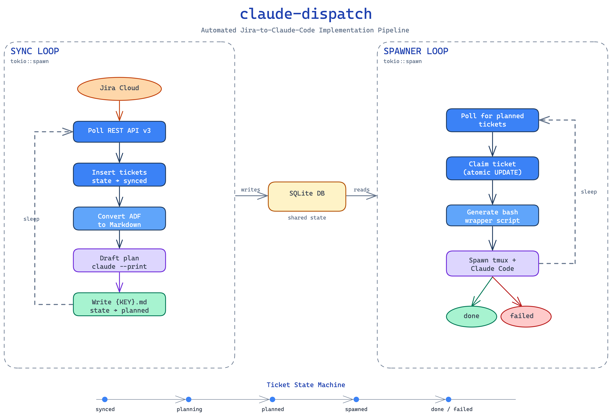

# claude-dispatch

A Rust daemon that bridges Jira and [Claude Code](https://docs.anthropic.com/en/docs/claude-code) to automatically implement tickets. It polls Jira for in-progress issues, generates implementation plans via headless Claude Code sessions, then spawns tmux windows where Claude Code executes those plans against your codebase.

## How It Works



### Ticket Lifecycle

Each ticket flows through a state machine tracked in SQLite:

```
synced → planning → planned → spawned → done
                                      → failed
```

1. **Sync** — The sync loop polls Jira for tickets matching your JQL query, converts their Atlassian Document Format descriptions to markdown, and inserts them into the local database.
2. **Plan** — For each new ticket, Claude Code runs in headless mode (`claude --print`) to draft an implementation plan, saved as a `.md` file.
3. **Spawn** — The spawner loop picks up planned tickets, generates a wrapper script, and opens a tmux window running an interactive Claude Code session with the plan as context.
4. **Done** — When the Claude Code session finishes, the wrapper calls `claude-dispatch mark-done TICKET_KEY` to update state and clean up.

## Prerequisites

- [Rust](https://www.rust-lang.org/tools/install) (2024 edition)
- [just](https://github.com/casey/just) (command runner)
- [tmux](https://github.com/tmux/tmux)
- [Claude Code CLI](https://docs.anthropic.com/en/docs/claude-code) (`claude` must be on your PATH)
- A Jira Cloud instance with an [API token](https://support.atlassian.com/atlassian-account/docs/manage-api-tokens-for-your-atlassian-account/)

## Getting Started

### 1. Clone and build

```bash
git clone https://github.com/tielitz/claude-jira-workflow.git
cd claude-jira-workflow
just setup   # configure git hooks
just build   # compile in debug mode
```

### 2. Configure

Copy the example config and fill in your values:

```bash
cp config.example.toml config.toml
```

```toml
[jira]
instance = "mycompany"               # → https://mycompany.atlassian.net
email = "you@company.com"
api_token = "your-api-token"
cron_schedule = "0 */5 * * * *"       # 6-field cron: sec min hour dom month dow
fetch_limit = 5
jql = 'assignee = currentUser() AND status = "In Progress"'

[claude]
home_dir = "~/.claude-dispatch"
extra_flags = ""
plan_prompt_template = ""             # optional custom prompt for planner

[paths]
output_dir = "~/.dev-pipeline/tickets"
repo_root = "~/projects/my-service"   # the repo Claude Code will work in
state_dir = "~/.dev-pipeline"
log_dir = "~/.dev-pipeline/logs"

[worktree]
enabled = true
branch_prefix = "feature"
base_branch = "main"

[tmux]
session_name = "dev-pipeline"

[spawner]
poll_interval_secs = 10
```

All paths support `~/` expansion. The `jql` field controls which tickets are picked up — adjust it to match your workflow.

See [Configuration](#configuration) below for details on how config files, environment variables, and CLI flags are layered.

### 3. Run

```bash
just run
```

The daemon starts two concurrent loops (sync + spawner) and logs to both stderr and rolling log files in your configured `log_dir`.

Attach to the tmux session to observe Claude Code working:

```bash
tmux attach -t dev-pipeline
```

## Configuration

`claude-dispatch` resolves its configuration from four sources, applied in ascending precedence (later sources override earlier ones):

1. **Per-OS user config** — auto-discovered on startup:
   - Linux: `~/.config/claude-dispatch/config.toml`
   - macOS: `~/Library/Application Support/dev.claude-dispatch.claude-dispatch/config.toml`
   - Windows: `C:\Users\<user>\AppData\Roaming\claude-dispatch\claude-dispatch\config\config.toml`
2. **Binary-adjacent** — `config.toml` next to the executable, e.g. `target/release/config.toml`.
3. **Environment variables** — any var prefixed `CLAUDE_DISPATCH_` overlays on top of the file sources. Use `__` (double underscore) to nest into sections:
   - `CLAUDE_DISPATCH_JIRA__EMAIL=you@company.com`
   - `CLAUDE_DISPATCH_SPAWNER__POLL_INTERVAL_SECS=30`

   Values are coerced in the order `bool → i64 → String`, so `"true"` becomes a boolean and `"42"` becomes an integer.
4. **`-c PATH` / `--config PATH`** — an explicit path that replaces both file-based defaults. Environment variables still overlay on top.

### First-run wizard

If no config file exists in the user-config or binary-adjacent locations (and no env vars are set), the binary writes `config.example.toml` to the per-OS user config path, prints a message pointing at the new file, and exits with status `2`. Edit the template with your Jira credentials and run again.

You can also bootstrap a template manually at any time:

```bash
claude-dispatch --init
# or from the repo:
just init-config
```

### Inspecting the merged config

```bash
claude-dispatch --print-config
```

Prints the fully merged configuration (secrets like `api_token` are redacted). Useful for debugging precedence or env-var overlay.

### Schema version

Each config file begins with `schema_version = 1`. Unsupported versions cause startup to abort with a clear error, so old configs are never silently misinterpreted.

### Dev workflow

For local development, always run with an explicit `-c config.toml` so the binary uses the repo's checked-in dev config instead of picking up your personal `~/.config/claude-dispatch/config.toml`. The `just run` recipe does this for you:

```bash
just run        # runs `cargo run -- -c config.toml`
```

## Development

```bash
just build          # cargo build
just release        # cargo build --release
just test           # cargo test
just check          # cargo clippy -- -D warnings && cargo fmt --check
just fmt            # cargo fmt
```

## Project Structure

```
src/
├── main.rs          # CLI entry point, tokio runtime, pipeline orchestration
├── config/          # Layered TOML + env config loader (see Configuration above)
│   ├── mod.rs       # Public Config struct + accessor methods
│   ├── schema.rs    # Deserialize structs, default fns, Debug redaction
│   ├── loader.rs    # load() orchestration, source resolution, TOML merge, env parsing
│   ├── paths.rs     # Per-OS path helpers + ~/ expansion
│   ├── migrate.rs   # schema_version check + future structural migrations
│   ├── wizard.rs    # First-run template bootstrap
│   ├── validate.rs  # Multi-issue validation pass
│   └── error.rs     # ConfigError enum
├── state.rs         # SQLite state machine (WAL mode, atomic transitions)
├── spawner.rs       # Spawner loop: claims planned tickets, launches tmux sessions
├── planner.rs       # Invokes headless Claude Code to generate implementation plans
├── markdown.rs      # Generates ticket markdown with YAML frontmatter
└── jira/
    ├── mod.rs       # Sync loop: polls Jira, inserts tickets, triggers planning
    ├── client.rs    # Jira REST API v3 client (Basic auth)
    └── adf.rs       # Atlassian Document Format → Markdown converter
```

## License

[MIT](LICENSE)
